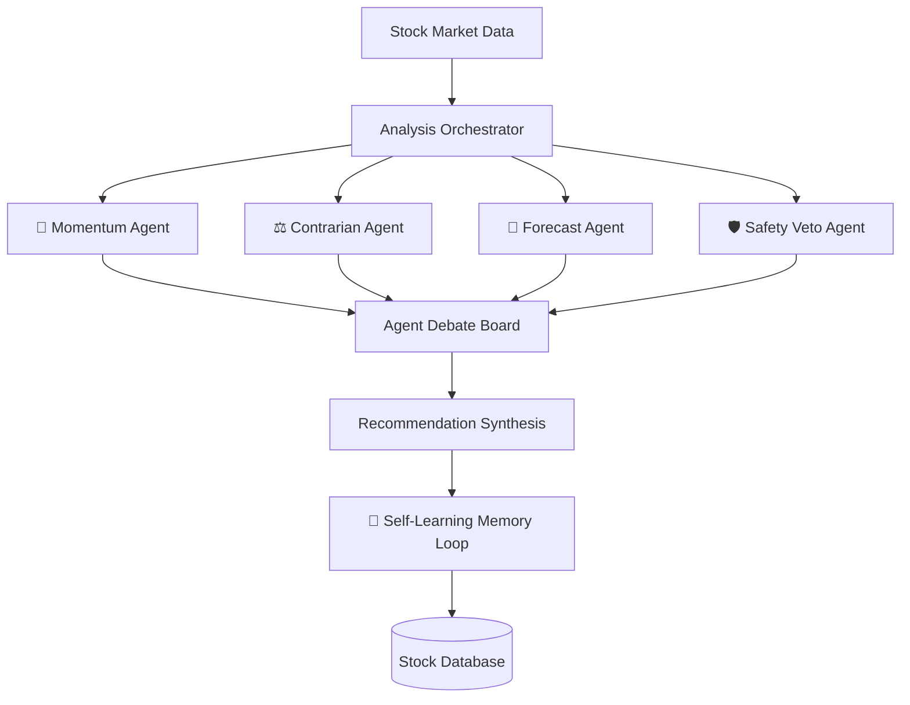

# 📊 Agentic Quantitative Stock Research System

[](https://fastapi.tiangolo.com/)
[](https://reactjs.org/)
[](https://www.python.org/)
[](https://facebook.github.io/prophet/)
[](https://opensource.org/licenses/MIT)

An advanced, AI-driven stock analysis platform specifically engineered for the Indian markets (NSE). This system utilizes a **multi-agent orchestration layer** to synthesize technical indicators, fundamental health, and real-time sentiment into institutional-grade research.

---

## 🤖 System Architecture: Multi-Agent Orchestration

The core of the system is a sophisticated multi-agent framework that replicates an investment committee's debate. Each agent specializes in a specific dimension of market analysis.



### 🧥 Meet the Agents

- **🚀 Value/Momentum Agent**: Evaluates 20+ technical and fundamental checkpoints to identify high-probability trend continuation.
- **⚖️ Contrarian (Divergence) Agent**: Specifically looks for bearish/bullish divergences where price action contradicts underlying momentum or fundamental value.
- **🔮 Forecast Agent**: Leverages **Meta's Prophet** time-series model to predict price movements over a 7-day horizon with statistical confidence intervals.
- **🛡️ Safety Veto Agent**: The final "Risk Officer" that enforces strict liquidity and volatility protocols, capable of downgrading a 'BUY' to 'WATCHLIST' if risk-reward metrics are unfavorable.

---

## 🔥 Key Features

### 🧠 Self-Learning Memory Loop

The system doesn't just predict; it learns. When a recommendation hits a stop-loss, the **Memory Loop** triggers:

1.  **Failure Analysis**: Uses Gemini to analyze technical, fundamental, and sentiment data at the time of failure.
2.  **Lesson Generation**: Distills a specific "lesson learned" stored in the database.
3.  **Adaptive Weighting**: Dynamically adjusts the influence (weight) of specific analysis components to prevent repeating mistakes.

### 📈 Quantitative Analysis Engine

- **Technical Analysis**: Full RSI, EMA (20/50/200), MACD, and Bollinger Band analysis across 500+ NSE stocks.
- **Deep Fundamentals**: Automated scraping and analysis of P/E ratios, EPS growth, and shareholding patterns (Promoter, FII, DII).
- **Sentiment Intelligence**: Powered by **FinBERT**, a specialized NLP model for financial sentiment, analyzing real-time news to gauge market confidence.

### 💻 Premium User Experience

- **Modern React Dashboard**: High-fidelity dark mode with glassmorphism design.
- **Real-time Interaction**: Interactive price charts and forecast visualizations using Recharts.
- **Agent Debate Board**: Transparent view into the internal reasoning and "conflict" between different AI agents.

---

## 🚀 Tech Stack

| Layer           | Technologies                                                         |
| :-------------- | :------------------------------------------------------------------- |
| **Backend**     | Python 3.9+, FastAPI, SQLAlchemy, Pydantic                           |
| **Frontend**    | React, TypeScript, Vite, Recharts, CSS3 (Glassmorphism)              |
| **Data Engine** | NSEPython, yfinance, Pandas, NumPy                                   |
| **AI/ML**       | Meta Prophet (Forecasting), FinBERT (NLP), Google Gemini (Reasoning) |
| **Persistence** | SQLite (Production-ready via SQLAlchemy)                             |

---

## 🛠️ Quick Start

### 1. Backend Setup

```bash
git clone https://github.com/your-username/Stock-Market.git
cd Stock-Market

# Setup Virtual Environment
python -m venv venv
venv\Scripts\activate # Windows
# source venv/bin/activate # Linux/Mac

# Install Dependencies
pip install -r requirements.txt
```

### 2. Environment Configuration

Create a `.env` file in the root directory:

```env
GEMINI_API_KEY=your_gemini_api_key
# Optional: Database URL, defaults to local SQLite
```

### 3. Launch Development Environment

**Start Backend:**

```bash
uvicorn app.main:app --host 127.0.0.1 --port 8000 --reload
```

**Start Frontend:**

```bash
cd react-frontend
npm install
npm run dev
```

---

## 📡 API Architecture

| Endpoint                        | Description                                | Method |
| :------------------------------ | :----------------------------------------- | :----- |
| `/api/v1/analyze/{symbol}`      | Triggers full agentic research on a stock  | `POST` |
| `/api/v1/top-picks`             | Retrieves daily buy/sell recommendations   | `GET`  |
| `/api/v1/fundamentals/{symbol}` | Deep-dive into financial health & holdings | `GET`  |
| `/api/v1/sentiment/{symbol}`    | Real-time FinBERT news sentiment score     | `GET`  |

---

## ⚠️ Disclaimer

**Educational Purpose Only.** This platform is a research project and does not constitute financial advice. Trading in the Indian stock market involves significant risk. Always consult with a SEBI-registered professional.

---

## 📄 License

This project is licensed under the MIT License - see the [LICENSE](LICENSE) file for details.
